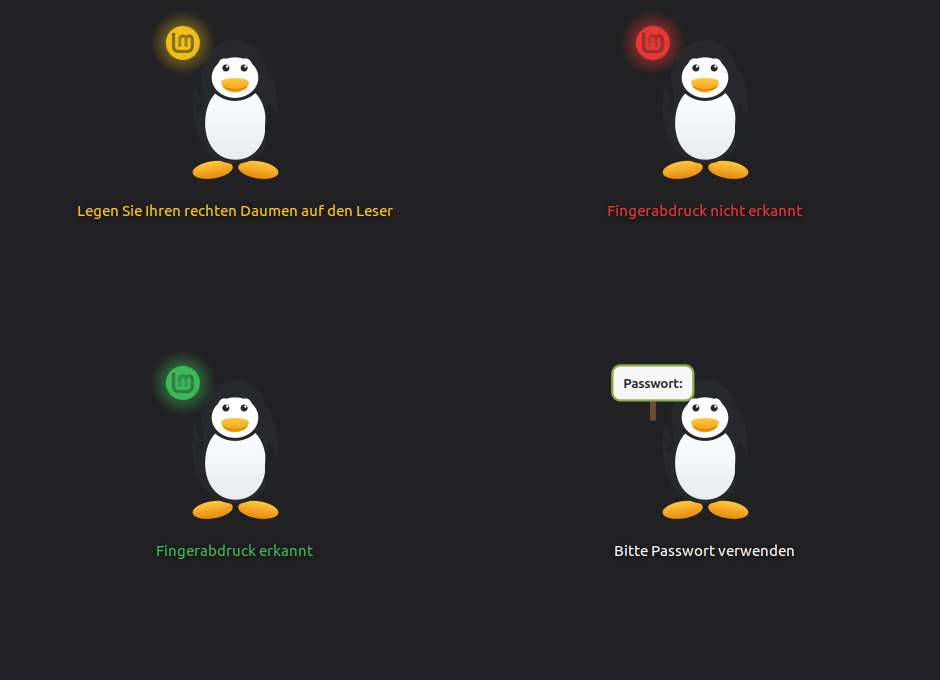

# screensaver-fprint

A fork of
[cinnamon-screensaver](https://github.com/linuxmint/cinnamon-screensaver) that
gives the lock screen the same fingerprint panel the login screen gets from
[greeter-fprint](https://github.com/SoulInfernoDE/greeter-fprint) — one message
at a time, in German, next to the finger you are actually using.

Unofficial. Not affiliated with, endorsed by, or supported by Linux Mint.
Upstream's own README is kept as
[README.cinnamon-screensaver.md](README.cinnamon-screensaver.md).



## What it changes

| State | What you see |
|---|---|
| Waiting | Mint logo glows yellow, breathing |
| Rejected | Logo flashes red for 1.5 s, then back to waiting |
| Recognised | Logo glows green for 1.5 s, then the screen unlocks |
| Reader gave up | Tux swaps the logo for a "Passwort:" sign |
| Wrong password | The sign stays; only the message goes red |

Upstream routes `pam_fprintd`'s chatter into `authinfo_label`, one line under
the other, in whatever language happens to arrive. Fingerprint messages now go
to the panel instead; everything else still reaches the original label
untouched.

Three consequences of that, each a bug in its own right:

- `on_authentication_failure()` said **"Incorrect password"** even when nothing
  had been typed. A rejected finger is now reported as such, and a rejected
  password still says what it always said.
- `on_authentication_success()` flashes green and unlocks when the flash has
  been seen, instead of unlocking out from under it.
- A prompt arriving after the reader has been talking means `pam_fprintd` used
  up its tries, which is what puts the sign in Tux's hand — driven by PAM
  rather than by counting attempts ourselves.

## The upstream bug this had to work around

`cinnamon-screensaver-pam-helper.c` drops `PAM_ERROR_MSG` without forwarding
it:

```c
case CS_AUTH_MESSAGE_ERROR_MSG:
    DEBUG ("CS_AUTH_MESSAGE_ERROR_MSG\n");
    break;
```

That is exactly how `pam_fprintd` reports "Failed to match fingerprint", so a
rejected finger reaches the UI as nothing at all — which is why upstream's lock
screen gives no feedback for one. It affects **every** PAM module's error text
on this lock screen, not just the reader's.

Rather than patch a setuid-root authentication helper, this fork infers the
rejection from what does arrive: the reader re-arms by re-sending its ordinary
prompt, and it only re-arms after refusing something. That inference is behind
an explicit flag (`rearm_means_failure`), set only here — the greeter receives
the real message and does not need it.

## Safety

Every entry point into the panel is wrapped. This code is an addition to an
authentication dialog: a panel that fails to update is cosmetic, a lock screen
that dies is not. Failures are written straight to stderr with
`traceback.format_exc()`, which also routes around cinnamon-screensaver's own
`sys.excepthook` — that hook fails while printing and leaves nothing but
`Original exception was:` in the journal.

## Install

The changes are Python only, so no build is needed. **Back up the file you are
replacing first** — this is the lock screen:

```bash
sudo cp /usr/share/cinnamon-screensaver/unlock.py \
        /usr/share/cinnamon-screensaver/unlock.py.bak-$(date +%Y%m%d%H%M%S)

sudo install -m 644 src/fingerprintPanel.py src/fingerprintMessages.py src/unlock.py \
        /usr/share/cinnamon-screensaver/

cinnamon-screensaver-command --exit
```

If the unlock dialog misbehaves: Ctrl+Alt+F2 to a TTY, restore the backup, and
`pkill -f cinnamon-screensaver`.

`CS_FPRINT_DEBUG=1 cinnamon-screensaver --debug` prints every message the dialog
receives. Stop the running instance first (`cinnamon-screensaver-command
--exit`), or the new one cannot take the D-Bus name and exits immediately.

## Artwork and translations

Both are shared with greeter-fprint rather than duplicated: Tux is loaded from
`/usr/share/greeter-fprint/tux-fprint.svg` (with an in-tree fallback path), and
the strings come from that project's gettext catalogue, bound as `_p()` — not
`_`, because cinnamon-screensaver installs its own `_` into builtins and
shadowing it would silently untranslate the rest of the dialog.

## Licence

GPL-2+, like cinnamon-screensaver. See [COPYING](COPYING) and
[COPYRIGHT.md](COPYRIGHT.md).

Tux is the Linux mascot created by Larry Ewing. The Linux Mint logo is not in
this repository; the panel uses the system's installed icon at runtime.
