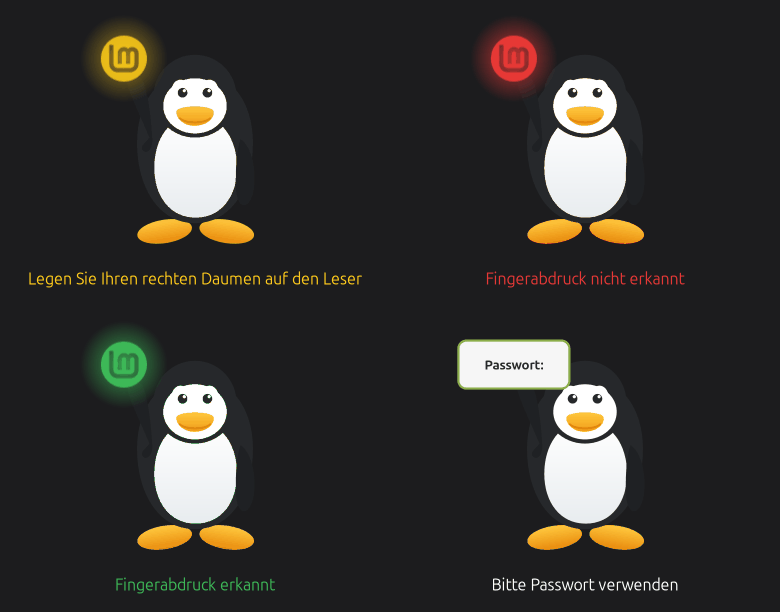

# How it works

***English** · [Deutsch](HOW-IT-WORKS.de.md)*

## What changes

Upstream routes `pam_fprintd`'s messages into `authinfo_label`, one line under
the other. Fingerprint messages now go to the panel instead; everything else
still reaches the original label untouched.

Three bugs go away with that:

- `on_authentication_failure()` said "Incorrect password" even when nothing had
  been typed. A rejected finger is now reported as such; a rejected password
  still says what it always said.
- `on_authentication_success()` flashes green and unlocks once the flash has
  been seen, instead of unlocking out from under it.
- A password prompt arriving after the reader has been talking means
  `pam_fprintd` used up its tries. That is what puts the sign in Tux's hand —
  driven by PAM, not by counting attempts.

## The upstream bug this works around

`cinnamon-screensaver-pam-helper.c` drops `PAM_ERROR_MSG` without forwarding it:

```c
case CS_AUTH_MESSAGE_ERROR_MSG:
    DEBUG ("CS_AUTH_MESSAGE_ERROR_MSG\n");
    break;
```

That is exactly how `pam_fprintd` reports "Failed to match fingerprint", so a
rejected finger reaches the screen as nothing at all. It affects every PAM
module's error text on this lock screen, not just the reader's.

Rather than patch a setuid-root authentication helper, this fork infers the
rejection from what does arrive: the reader re-arms by sending its ordinary
prompt again, and it only re-arms after refusing something. That inference sits
behind an explicit flag, `rearm_means_failure`, set only here — the greeter
receives the real message and does not need it.

## Safety

Every entry point into the panel is wrapped. This is an addition to an
authentication dialog: a panel that fails to update is cosmetic, a lock screen
that dies is not. Failures go straight to stderr with `traceback.format_exc()`,
which also routes around cinnamon-screensaver's own `sys.excepthook` — that hook
fails while printing and leaves only `Original exception was:` in the journal.

## Artwork and translations

Both come from greeter-fprint instead of being duplicated. Tux is loaded from
`/usr/share/greeter-fprint/tux-fprint.svg`, and every text from that project's
gettext catalogue, with English as the base and fallback — see its
[translation notes](https://github.com/SoulInfernoDE/greeter-fprint/blob/main/docs/TRANSLATIONS.md).

The catalogue is bound as `_p()`, not `_`: cinnamon-screensaver installs its own
`_` into builtins, and shadowing it would silently untranslate the rest of the
dialog.

Unlike at the login screen, the reader's messages may already arrive here in
German, because this process does call `setlocale()`. They are therefore
*recognised* in English and in German — but what is shown always comes from the
catalogue.

## Debugging

```bash
cinnamon-screensaver-command --exit
CS_FPRINT_DEBUG=1 cinnamon-screensaver --debug
```

Prints every message the dialog receives. Stop the running instance first, or
the new one cannot take the D-Bus name and exits immediately.

## The animation

Rendered with the panel's own drawing code, so the timings are the real ones:
each flash holds for 1.5 s. Stills of the main states:


